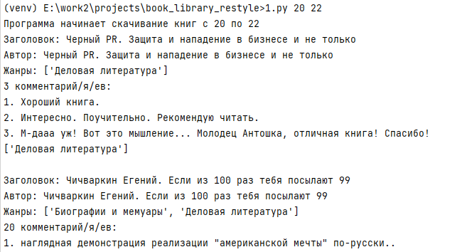

# Скачиваем книги из библиотеки Tululu

Учебный проект по скачиванию книг с сайта [tululu.org](tululu.org) Бесплатной библиотеки.
___________________
### Требования
Нужен Python от версии 3.8.

### Как установить 
Скачайте код.
Нужно запустить `pip` (или `pip3` при наличии конфликтов с Python2) 
для установки зависимостей:
```commandline
pip install -r requirements.txt
```
Рекомендуется использовать [virtual/venv](https:..docs.python.org/3/library/venv.html) 
для изоляции проекта
______
### Работа со скриптом
Скрипту можно передать два позиционных параметра - с номера какой книги в библиотеки начинать качать, и каким заканчивать.
Параметры передаются в этом порядке.

После запуска скрипт скачает книги, обложки к ним (если есть). 
В ходе работы выведет в консоль информацию по книге - название, автор, жанр, количество и содержание комментариев. 

### Пример запуска скрипта: 
```commandline
(venv) python parse_tululu.py 20 22 
```


### Цель проекта

Код написан в образовательных целях на онлайн-курсе для веб-разработчиков [dvmn.org](https://dvmn.org/).